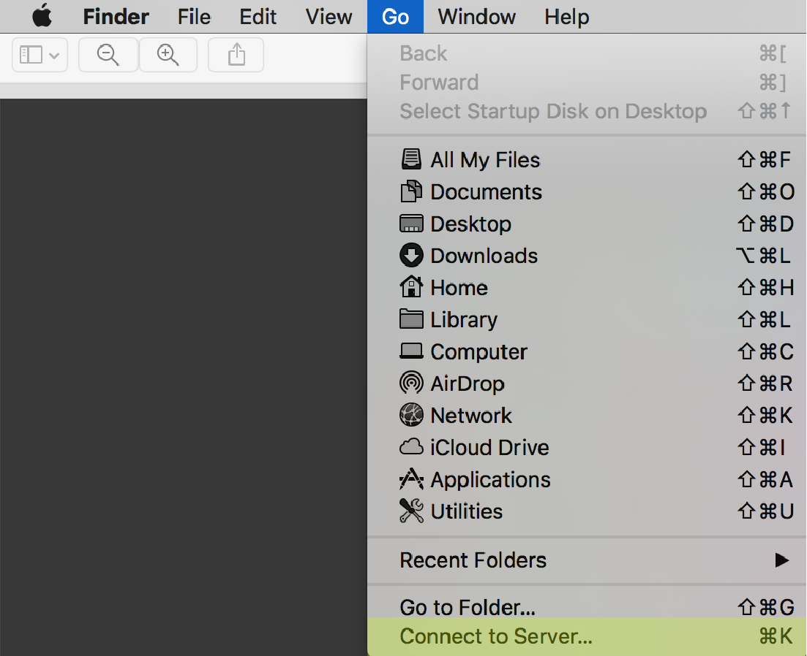
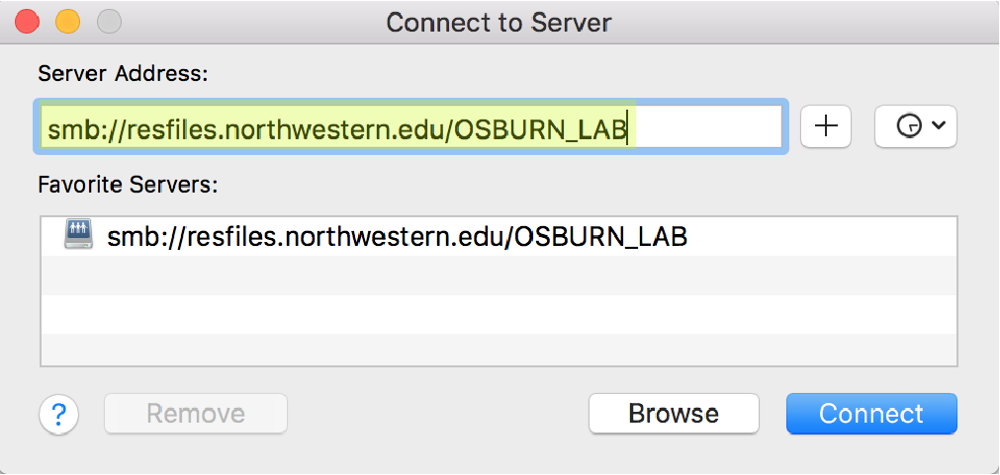
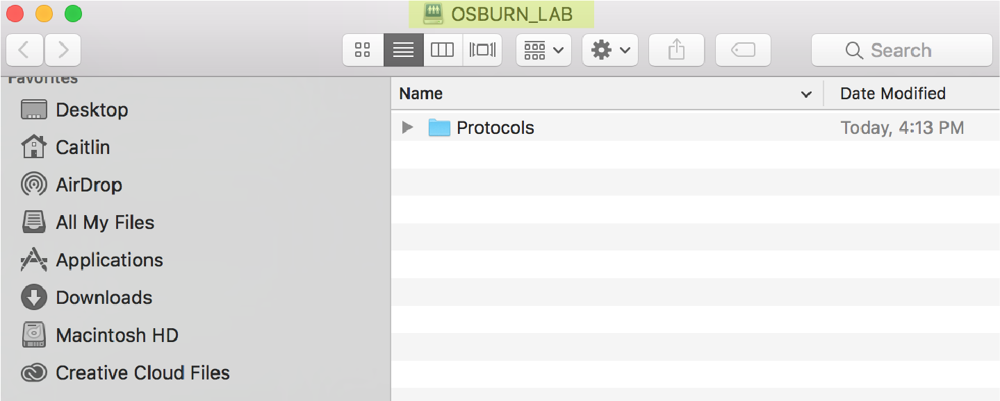
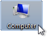
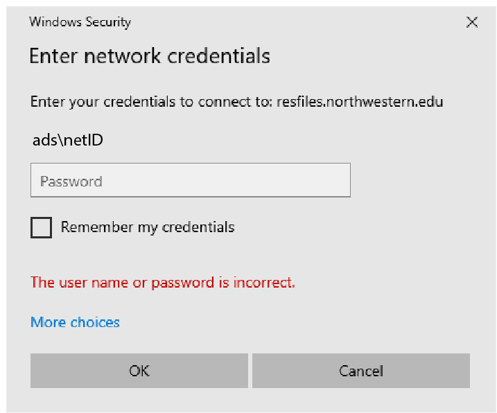
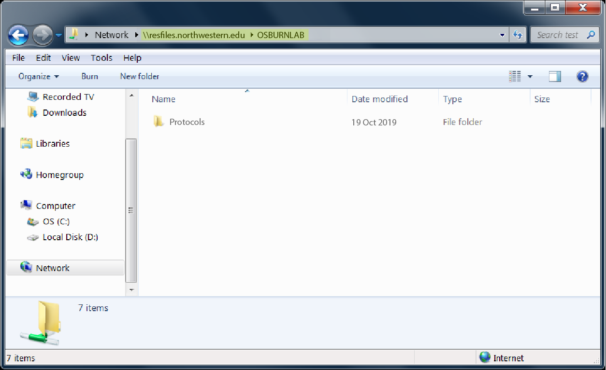

# | Data Access + Storage {#data-access}

The Osburn Lab data is backed up to [RDSS](https://www.it.northwestern.edu/research/user-services/storage/research-data.htm) at Northwestern. You can access this data if you have permissions using the directions here. If you do not currently have access, you will need to be added as a user by Caitlin or Maggie. 

## MacOS Users

Open Finder and navigate to Go > Connect to Server...

```{r, echo=FALSE}

```

Add this server address: smb://resfiles.northwestern.edu/OSBURN_LAB

```{r, echo=FALSE}

```

Add your netID and password. Finder will automatically open OSBURNLAB in your system Volumes. 

```{r, echo=FALSE}

```

To navigate to the OSBURNLAB dirctory in your terminal:
```{bash}
cd /Volumes/OSBURN_LAB
```

## Windows Users

Open windows file explorer (not the web browser) by double clicking the computer desktop icon

```{r, echo=FALSE}

```

Add this server address: resfiles.northwestern.edu/OSBURN_LAB

```{r, echo=FALSE}

```


The contents of OSBURNLAB is displayed in the window.
```{r, echo=FALSE}

```
