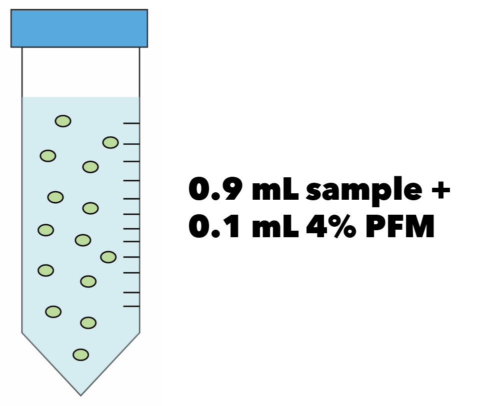
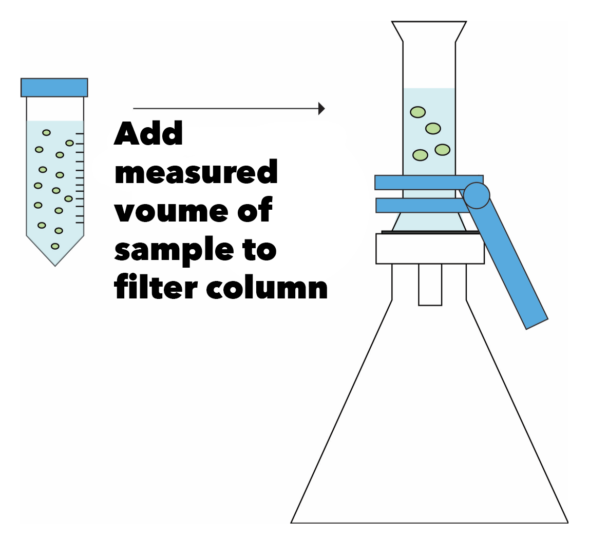
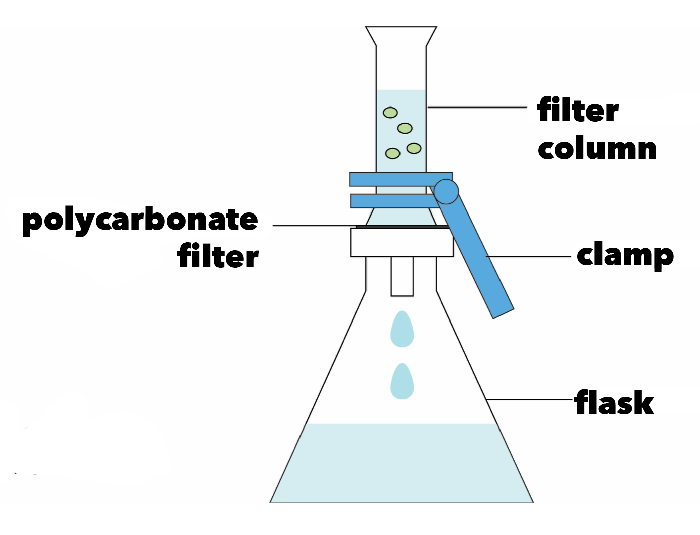
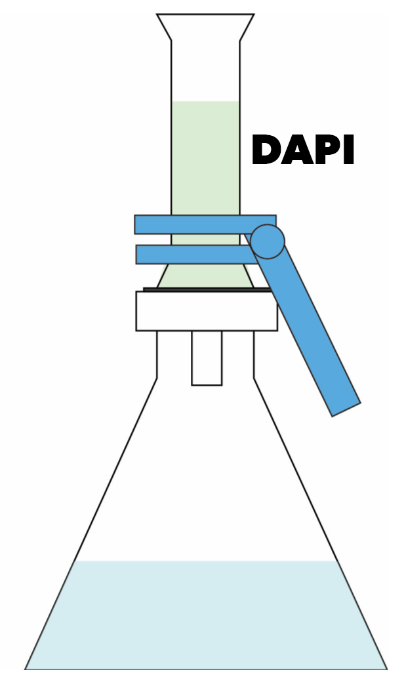
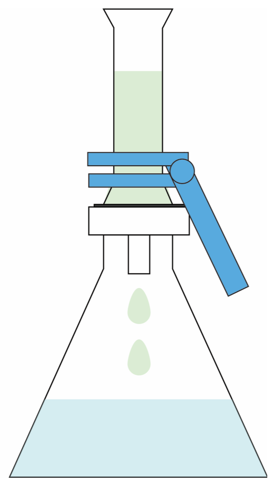
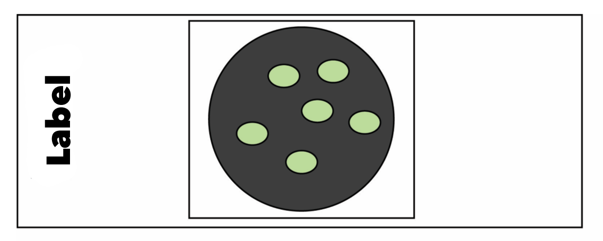
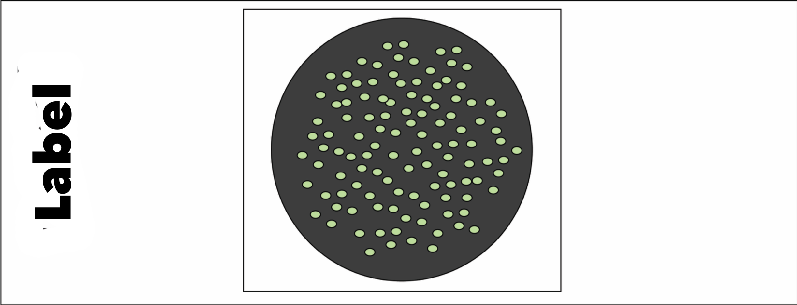
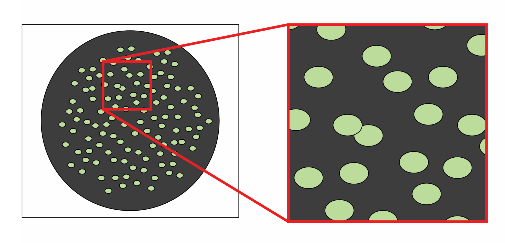
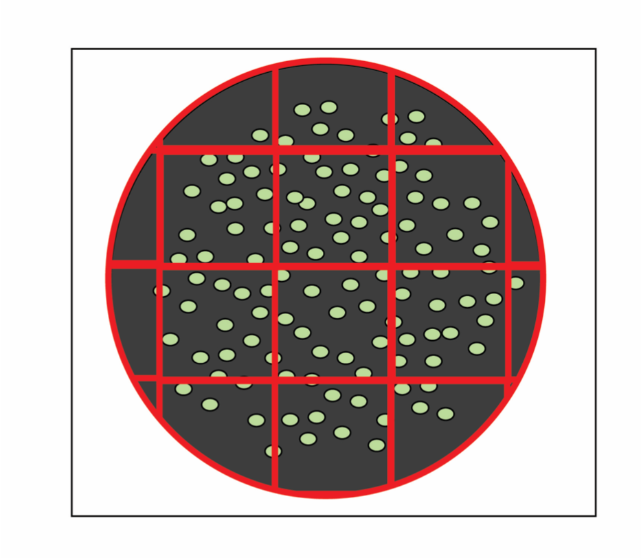

# | DAPI + Cell Counting {#DAPI}
<font size="1">**Created By:** Caitlin Casar on 2020-01-27 <br /> 
**Last updated:** 2020-01-27 </font>

## Sample prep

1. Prepare your cells by fixation for 30 minutes at room temperature. 
    <ul>
    <li>Add 0.1 ml 4% paraformaldehyde/PBS solution to a 2ml tube</li>
    <li>Add 0.9ml cell suspension</li>
    </ul>
    
<ul>   
```{r out.width = "250px", echo=FALSE, fig.cap='Fix your sample.'}

```
</ul>

2. Use sterile foreceps to place a glass microfiber Whatman filter on the filter mount. Wet the filter with filtered DI water and vacuum so that it is damp.

3. Use sterile forceps to place a polycarbonate Whatman filter on top of the glass microfiber filter. Wet the filter with filtered DI water and vacuum dry to flatten evenly. (Beware of the “taco” effect - the surface tension of the water on the polycarbonate filter may cause it to fold up on itself and it is very difficult to re-flatten). 

4. Place the filter column over the stack filters and clamp down. 

5. Add a few ml of filtered DI water to the column, then add your fixed cell suspension avoiding the sides of the column. The water helps to evenly disperse the cells across the filter. If you accidentally drop your cells on the side of the column, use filtered DI water to wash them down. 
<ul>
```{r out.width = "250px", echo=FALSE, fig.cap='Add your sample to the filter column.'}

```
</ul>
6. Vacuum the fluids through. Open the vacuum line on the flask before the next step or it may draw a vacuum and pull your dye through. 
<ul>
```{r out.width = "250px", echo=FALSE, fig.cap='Vacuum your sample through the filter.'}

```
</ul>
7. Dim the lights and close the curtain, DAPI is extremely photo-sensitive. Drip filtered DAPI down the side of the filter column so as not to disturb your cells on the filter. Add enough to completely cover the entire filter. 
<ul>
```{r out.width = "200px", echo=FALSE, fig.cap='Dye your sample with DAPI.'}

```
</ul>
8. Set a timer for ten minutes. After the timer goes off, vacuum the dye to dry the filter. 
<ul>
```{r out.width = "200px", echo=FALSE, fig.cap='Vacuum the dye through the filter.'}

```
</ul>
9. Add a drop of immersion oil to a glass slide. Use sterile forceps to place the filter onto the drop of oil. 

10. Add a drop of immersion oil on top of the filter. Do not touch the filter with the oil dropper or it may contaminate the oil. Place a glass coverslip over the filter, taking care to push out the bubbles. 
<ul>
```{r out.width = "250px", echo=FALSE, fig.cap='Prepare your slide.'}

```
</ul>
11. Add a drop of immersion oil to the top of the glass coverslip. You are now ready to place the slide on the microscope stage for use with the 100x oil objective. 


## Operating the Microscope


1. Remove the dust cover and turn on the power source, then power on the microscope. 

2. Power on the X-Cite lamp. Once the lamp is turned on, do not power off for at least 30 minutes. 

3. Open the Zen software. If you open the software before the microscope has been powered on, the software will try to communicate with the scope and get confused and will need to be rebooted. 

4. Turn on the DAPI RL (reflected light) 

5. Carefully lower the objective onto the drop of oil on your coverslip. When the objective makes contact with the oil, you will see a flash of light. 

6. Continue to lower the objective until you encounter the focal plane. The focal plane tends to be far down in the Z-direction. If you go too far in the Z-direction you will crack your slide and potentially damage the objective lense, so take your time! 

7. To view the image on the software, pull the eyepiece rod halfway out to direct 50% light to your eye and 50% to the camera. Pull the rod all the way out to direct light 100% to the camera. Click the “Live” button on the Locate tab in the laft panel and set the camera exposure. 

8. To acquire an image, click the “snap” button. If you want to save the images in their proprietary format, right click the image on the right panel and save. If you want them in jpg format, switch to the processing tab in the left panel and export the images to your file folder. 

9. You can add a scale bar with the graphics tool. 

10. When you’re finished, turn off the reflected light and remove your slide. Use lens paper to clean the oil off of the objective. 

11. Power off the software, then the microscope, then the power supply. Turn off the X-Cite lamp. 

12. Replace the dust cover on the microscope.


## Cell Counting

Bacteria densities (with the proper dilution) should be at least 30 organisms per field. 
<ul>
<li>Count at least 10 fields (to achieve a final count of 300 bacterial cells). </li>
<li>Calculate final bacterial densities using the following equation (from Wetzel and ikens, 1991).</li> 
</ul>
</font>


<font size="1">
Bacteria ml-1 = (membrane conversion factor * ND) </br>
Membrane conversion factor = Filtration area/area of micrometer field</br>
N = Total number of bacteria counted/number of micrometer fields counted </br>
D = Dilution factor; volume of sample stained/total volume of sample available 

<ul>
```{r out.width = "250px", echo=FALSE, fig.cap='Glowing cells on a filter.'}

```

```{r out.width = "250px", echo=FALSE, fig.cap='Count total of at least 300 cells, calculate average # cells/frame'}

```

```{r out.width = "250px", echo=FALSE, fig.cap='#cells/frame   x   #frames/filter  =  total cell count/volume'}

```
</ul>
