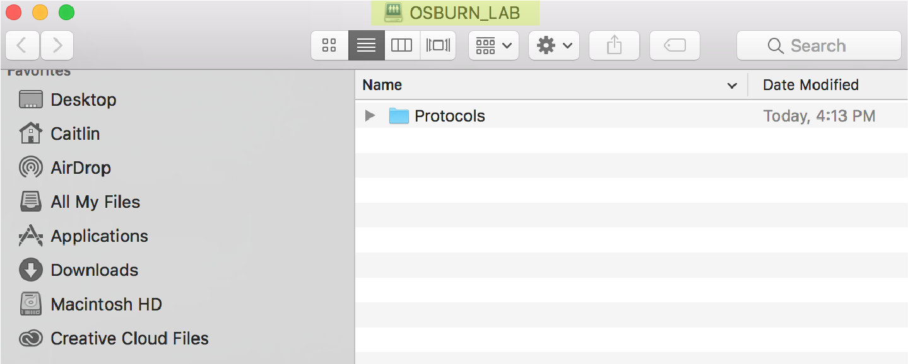
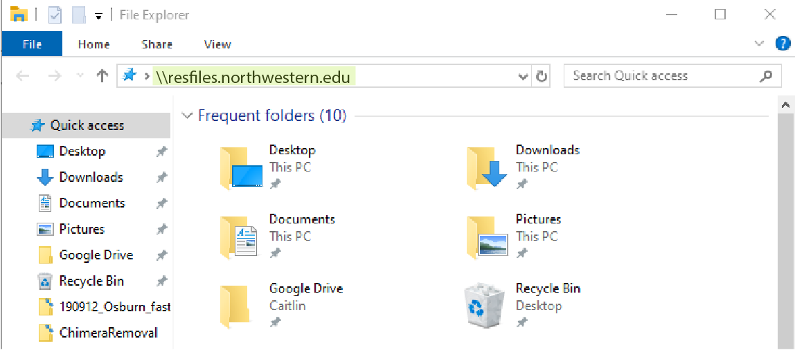
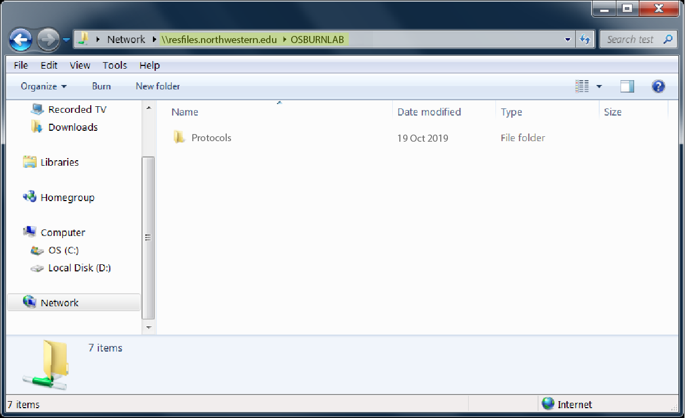

--- 
title: "Osburn Lab Protocols"
author: "By Caitlin Casar"
date: "**Created:** 2019-10-16 **Last updated:** `r Sys.Date()`"
site: bookdown::bookdown_site
output: 
  bookdown::gitbook:
    config:
      sharing: null
documentclass: book
bibliography: [book.bib, packages.bib]
biblio-style: apalike
link-citations: yes
github-repo: rstudio/osburnlab/protocols
description: "This is a collection of protocols for the Osburn Lab."
---

# | About 

This is a collection of protocols for the Osburn Lab `r emo::ji("sunglasses")`

```{r, echo=FALSE, fig.cap='Osburn Lab Spring 2019'}
knitr::include_graphics("images/IMG_4550.JPG")
```


<!--chapter:end:index.Rmd-->

# | Data Access + Storage {#data-access}

The Osburn Lab data is backed up to [RDSS](https://www.it.northwestern.edu/research/user-services/storage/research-data.htm) at Northwestern. You can access this data if you have permissions using the directions here. If you do not currently have access, you will need to be added as a user by Caitlin or Maggie. 

## MacOS Users

Open Finder and navigate to Go > Connect to Server...

```{r, echo=FALSE}
knitr::include_graphics("images/rdss-1.png")
```

Add this server address: smb://resfiles.northwestern.edu/OSBURN_LAB

```{r, echo=FALSE}
knitr::include_graphics("images/rdss-2.png")
```

Add your netID and password. Finder will automatically open OSBURNLAB in your system Volumes. 

```{r, echo=FALSE}

```

To navigate to the OSBURNLAB dirctory in your terminal:
```{bash}
cd /Volumes/OSBURN_LAB
```

## Windows Users

Open windows file explorer (not the web browser) by double clicking the computer desktop icon

```{r, echo=FALSE}

```

Add this server address: resfiles.northwestern.edu/OSBURN_LAB

```{r, echo=FALSE}
knitr::include_graphics("images/rdss-5.png")
```


The contents of OSBURNLAB is displayed in the window.
```{r, echo=FALSE}

```

<!--chapter:end:01-data-access.Rmd-->

# | Version Control {#version-control}

If you're writing code, it's very important to implement version control with Git. This guide will get you started!


First you'll need to [install Git](https://www.linode.com/docs/development/version-control/how-to-install-git-on-linux-mac-and-windows/).

Next, create an account on [Github](https://github.com). If you want access to provate repositories (i.e. if you need to backup unpublished data or code), be sure to set up a student account.

Now, you'll need to set your credentials in Git. Open up your terminal.
```{bash, eval=FALSE}
#set your user name on github
git config --global user.name "John Doe"

#set your user email on github
git config --global user.email johndoe@example.com
```

Now, go to Github and create a repository for your code. 

```{r, echo=FALSE}

```


If you want this repository to be private, change the repo settings on Githib. Click on the settings button.
```{r, echo=FALSE}
knitr::include_graphics("images/git-2.png")
```

Then set the reposotory to private.
```{r, echo=FALSE}

```

Then clone this repository to your computer. You may be prompted to enter your Github password.
```{bash, eval=FALSE}
#change directories to the desired location for your repository
cd ~/Desktop

#clone your repository using the URL 
git clone https://github.com/OsburnLab/Protocols
```

Now you can add your code files to this cloned repository. When you're done editing your code, push it up to the Github server.

```{bash, eval=FALSE}
#add your new files to the queue
git add .

#commit your changes and add a short description
git commit -a -m "short description here"

#push your changes to the Github server
git push 
```


<!--chapter:end:02-version-control.Rmd-->

# | Create a Protocol

Wanna share a cool protocol with your lab mates in this bookdown document? Follow this guide to learn how! 

First, you'll need to clone this repository using Git in your terminal. 
```{bash, eval=FALSE}
#change directories to a desirable location
cd ~/Desktop
git clone https://github.com/OsburnLab/Protocols
```

Next, open the bookdown-demo.Rproj file in RStudio. Then, select File > New File > R Markdown...

Give this file a name in the format 'number-name.Rmd', where number is in sequential order with the other .Rmd files.

Add an H1 element chapter title to the file.
```{r, eval=FALSE}
# | Chapter Title
```

Next, add some paragraph content below this.
```{r, eval=FALSE}
# | Chapter Title
Here is some paragraph content.
```

To add a code chunk, equations, or figures, check out this [link](https://bookdown.org/yihui/bookdown/components.html).

When you're done editing the R markdown file, render the book.
```{r, eval=FALSE}
bookdown::render_book("index.rmd", "bookdown::gitbook")
```

Now it's time to update your changes online!
```{bash, eval=FALSE}
#change directories to the protocols folder
cd ~/Desktop/Protocols

#add all new files you created
git add.

#commit all of your changes and add a short description about your update
git commit -a -m "short description here"

#push your changes to the github server
git push

#update the rendered html file on the github-hosted page
cd _book
git add .
git commit -a -m "short description here"
git push
```


<!--chapter:end:03-create-protocol.Rmd-->

