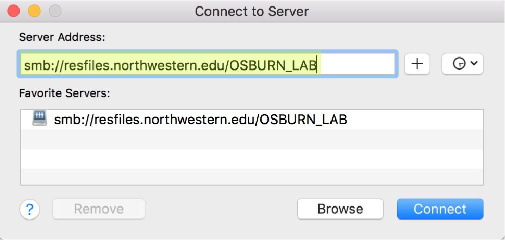
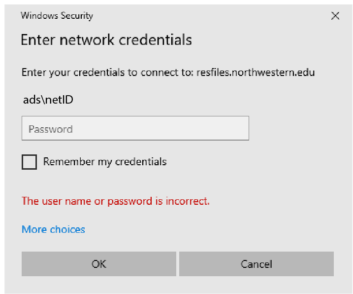

--- 
title: "Osburn Lab Protocols"
author: "By Caitlin Casar"
date: "**Created:** 2019-10-16 **Last updated:** `r Sys.Date()`"
site: bookdown::bookdown_site
output: 
  bookdown::gitbook:
    config:
      sharing: null
documentclass: book
bibliography: [book.bib, packages.bib]
biblio-style: apalike
link-citations: yes
github-repo: rstudio/osburnlab/protocols
description: "This is a collection of protocols for the Osburn Lab."
---

# | About 

This is a collection of protocols for the Osburn Lab `r emo::ji("sunglasses")`

```{r, echo=FALSE, fig.cap='Osburn Lab Spring 2019'}
knitr::include_graphics("images/IMG_4550.JPG")
```


<!--chapter:end:index.Rmd-->

# | Data Access + Storage {#data-access}
**Created:** 2019-10-16 

The Osburn Lab data is backed up to [RDSS](https://www.it.northwestern.edu/research/user-services/storage/research-data.htm) at Northwestern. You can access this data if you have permissions using the directions here. If you do not currently have access, you will need to be added as a user by Caitlin or Maggie. 

## MacOS Users

Open Finder and navigate to Go > Connect to Server...

```{r, echo=FALSE}
knitr::include_graphics("images/rdss-1.png")
```

Add this server address: smb://resfiles.northwestern.edu/OSBURN_LAB

```{r, echo=FALSE}

```

Add your netID and password. Finder will automatically open OSBURNLAB in your system Volumes. 

```{r, echo=FALSE}
knitr::include_graphics("images/rdss-3.png")
```

To navigate to the OSBURNLAB dirctory in your terminal:
```{bash, eval=FALSE}
cd /Volumes/OSBURN_LAB
```

## Windows Users

Open windows file explore and add this server address: resfiles.northwestern.edu

```{r, echo=FALSE}
knitr::include_graphics("images/rdss-4.png")
```


You will be prompted for your user name (netID) and password. 
```{r, echo=FALSE}

```


The contents of OSBURNLAB is displayed in the window.
```{r, echo=FALSE}
knitr::include_graphics("images/rdss-6.png")
```

<!--chapter:end:01-data-access.Rmd-->

# | Version Control {#version-control}
**Created:** 2019-10-16 

If you're writing code, it's very important to implement version control with Git. This guide will get you started!


First you'll need to [install Git](https://www.linode.com/docs/development/version-control/how-to-install-git-on-linux-mac-and-windows/).

Next, create an account on [Github](https://github.com). If you want access to provate repositories (i.e. if you need to backup unpublished data or code), be sure to set up a student account.

Now, you'll need to set your credentials in Git. Open up your terminal.
```{bash, eval=FALSE}
#set your user name on github
git config --global user.name "John Doe"

#set your user email on github
git config --global user.email johndoe@example.com
```

Now, go to Github and create a repository for your code. 

```{r, echo=FALSE}
knitr::include_graphics("images/git-1.png")
```


If you want this repository to be private, change the repo settings on Githib. Click on the settings button.
```{r, echo=FALSE}
knitr::include_graphics("images/git-2.png")
```

Then set the reposotory to private.
```{r, echo=FALSE}
knitr::include_graphics("images/git-3.png")
```

Then clone this repository to your computer. You may be prompted to enter your Github password.
```{bash, eval=FALSE}
#change directories to the desired location for your repository
cd ~/Desktop

#clone your repository using the URL 
git clone https://github.com/OsburnLab/Protocols
```

Now you can add your code files to this cloned repository. When you're done editing your code, push it up to the Github server.

```{bash, eval=FALSE}
#add your new files to the queue
git add .

#commit your changes and add a short description
git commit -a -m "short description here"

#push your changes to the Github server
git push 
```


<!--chapter:end:02-version-control.Rmd-->

# | Create a Protocol
**Created:** 2019-10-16 

Wanna share a cool protocol with your lab mates in this bookdown document? Follow this guide to learn how! 

First, you'll need to clone this repository using Git in your terminal. 
```{bash, eval=FALSE}
#change directories to a desirable location
cd ~/Desktop
git clone https://github.com/OsburnLab/Protocols
```

Next, open the bookdown-demo.Rproj file in RStudio. Then, select File > New File > R Markdown...

Give this file a name in the format 'number-name.Rmd', where number is in sequential order with the other .Rmd files.

Add an H1 element chapter title to the file.
```{r, eval=FALSE}
# | Chapter Title
```

Next, add some paragraph content below this.
```{r, eval=FALSE}
# | Chapter Title
Here is some paragraph content.
```

To add a code chunk, equations, or figures, check out this [link](https://bookdown.org/yihui/bookdown/components.html).

When you're done editing the R markdown file, render the book.
```{r, eval=FALSE}
bookdown::render_book("index.rmd", "bookdown::gitbook")
```

Now it's time to update your changes online!
```{bash, eval=FALSE}
#change directories to the protocols folder
cd ~/Desktop/Protocols

#add all new files you created
git add.

#commit all of your changes and add a short description about your update
git commit -a -m "short description here"

#push your changes to the github server
git push

#update the rendered html file on the github-hosted page
cd _book
git add .
git commit -a -m "short description here"
git push
```


<!--chapter:end:03-create-protocol.Rmd-->

# | Qiime2 workflow
**Created:** 2019-11-19
**Created by:** Matt Selensky

## Workflow for 16S amplicon sequence analysis in Qiime2

### 1. Import data

This protocol is designed for the processing of 16S rRNA gene amplicon data using 515F/806R primers. Qiime2 requires us to convert the raw data the sequencing center sends us into Qiime-zipped artifacts, or a ```.qza``` extension. We must first import our data (paired-end .fastq files) into this format:

```{python, echo=TRUE, eval=FALSE}
qiime tools import 
  --type EMPPairedEndSequences 
  --input-path emp-paired-end-sequences 
  --output-path emp-paired-end-sequences.qza
```

The above function requires three .fastq files. One for the forward reads, one for the reverse reads, and another for the barcodes. They *must* be named ```forward.fastq.gz```, ```reverse.fastq.gz```, and ```barcodes.fastq.gz```, respectively.

```qiime tools import``` will yield a single output, ```emp-paired-end-sequences.qza```, that will contain all of the barcoded reads from every single sample submitted to the sequencing center.

### 2. Demultiplexing

At the sequencing center, DNA sequences were given a barcode specific to each sample so we can track which sample our reads in the ```emp-paired-end-sequences.qza``` file originated from. We do this by *demultiplexing* our sequences.

In Qiime2, we need to create a metadata file that contains the barcodes used for each sample. Check out this [example](https://docs.google.com/spreadsheets/d/1y3yM50tW_23H7fXeou9XwyM92VNd8dCtgk8ndHOMSMs/edit#gid=0) from the Qiime2 documentation of how this metadata file should be formatted. The sequencing center should send a mapping file from which you can obtain the barcodes for each sample. Be sure to save the metadata file as a .tsv. Specify the barcodes and other associated metadata only for the samples you are interested in analyzing. As is often the case in our lab, sequencing data is typically sent back as a mix of samples from different projects. Only including your samples in the metadata file will subset the large ```.qza``` file and will significantly cut down on computation time.

Because we are demultiplexing EMP paired-end sequences, we should use the ```demux emp-paired``` command. The column which contains the barcode in the metadata file for each sample must be specified using the argument ```barcodes-column```:

```{python, echo=TRUE, eval=FALSE}
qiime demux emp-paired 
  --m-barcodes-file sample-metadata.tsv 
  --m-barcodes-column barcode-sequence 
  --i-seqs emp-paired-end-sequences.qza 
  --o-per-sample-sequences demux.qza 
```

Note: if you have reverse complement sequences, you must pass the argument, ```--p-rev-comp-mapping-barcodes``` to your ```demux``` command to account for this.

You can look at this on the [Qiime2 viewer](https://view.qiime2.org/) by producing a Qiime-zipped visualization file, ```.qzv```, from your now-demultiplexed ```.qza``` output:

```{python, echo=TRUE, eval=FALSE}
qiime demux summarize 
  --i-data demux.qza 
  --o-visualization demux.qzv
```

From the interactive quality plot in ```demux.qzv```, we can see the distribution of quality scores for each sequenced base. If analyzing paired-end data, you will see two plots: one for the forward read, and one for the reverse read. We use this visualization to inform how we will trim and truncate the ends of the reads in the next denoising step using ```dada2 denoise-paired```

### 3. Denoising

We will use the [DADA2](https://www.ncbi.nlm.nih.gov/pubmed/27214047) algorithm to denoise our data. DADA2 is a robust way to filter out noisy sequences, correct errors in marginal sequences, remove chimeras, remove singletons, join denoised paired-end reads, *and* dereplicate sequences. Previously, each of these functions would require separate commands, but DADA2 does it all-in-one. Therefore, this is a particularly computationally intense process. One should consider running ```dada2``` on a computer that can handle it (perhaps by accessing Northwestern's high-performance computing cluster, [Quest](https://www.it.northwestern.edu/research/user-services/quest/)).

```{python, echo=TRUE, eval=FALSE}
qiime dada2 denoise-paired 
  --i-demultiplexed-seqs demux.qza 
  --p-trim-left-f 13 
  --p-trim-left-r 13 
  --p-trunc-len-f 150 
  --p-trunc-len-r 150 
  --o-table table.qza 
  --o-representative-sequences rep-seqs.qza 
  --o-denoising-stats denoising-stats.qza
```

By inspecting the interactive ```demux.qzv``` file produced in the previous step on the [Qiime2 viewer](https://view.qiime2.org/), we observe that sequence quality scores are lower than average until base #14 in both the forward and reverse reads. We will want to trim these low-quality sequences from our data, as they might interfere with downstream processing. Use the argument ```p-trim``` to specify the number of nucleotides that should be trimmed from the left end of the forward (```left-f```) and reverse (```left-r```) reads, which we define as ```13``` here. Similarly, the ```p-trunc-len``` argument is used to trim the right ends of, or *truncate*, our reads.  Since we have paired-end data, our amplicons are 150 nucleotides long. We define ```p-trunc-len``` for the forward and reverse reads as ```150``` because we do not observe a drop off in quality scoring on their right ends in our ```demux.qzv``` file.

The output ```rep-seqs.qza``` will be used in the next step of our processing workflow.

### 4. Clustering

Now that we have our squeaky-clean reads, we will want to cluster them into operational taxonomic units (OTUs). We cluster our OTUs *de novo*. This means that we compare our sequences to each other (i.e., not against a reference database) to determine how they should be clustered. *De novo* OTU clustering requires more computational resources than reference-based clustering, but it has been shown to be generally more robust. An OTU is defined by some sequence homology cutoff (usually 97%). In other words, if using a 97% cutoff, reads are considered to be coming from the same OTU if at least 97% of their sequences are the same. 

```{python, echo=TRUE, eval=FALSE}
qiime vsearch cluster-features-de-novo 
  --i-table table.qza 
  --i-sequences rep-seqs.qza 
  --p-perc-identity 0.97 
  --o-clustered-table table-dn-97.qza 
  --o-clustered-sequences rep-seqs-dn-97.qza
```

### 5. Taxonomy

At this point, our OTUs lack any meaningful identification - we don't know whether OTU 'A' comes from the bacterium *E. coli* or the archaeum *S. solfataricus*! We determine who is present in our samples by assigning taxonomic IDs to each "query" sequence (from ```rep-seqs.qza```). We do this by comparing query sequences to a database of known reference sequences ( [Silva](https://www.arb-silva.de/documentation/silva-taxonomy/) is an excellent choice for our purposes). A major advantage of using Qiime2 is that it contains the ```classify-sklearn``` algorithm, which uses machine learning via Naive Bayes to classify sequences. As is the case with other machine learning applications, the classifier must be *trained*. Classifier training is required for every new reference database/amplicon pair, and would be the most resource-intensive step in our workflow by far. Luckily for us, Silva is routinely used to classify sequences coming from 16S rRNA gene amplification using the 515F/806R primers, and the Qiime2 developers provide a free, [pre-trained Silva classifier](https://docs.qiime2.org/2019.10/data-resources/) in their documentation for just that! Download this classifier - you will need it! At the time this was written, I used ```silva-132-99-515-806-nb-classifier-2018.qza```, the latest version of the pre-trained Silva classifier.

Even without the extra training step, it is highly recommended to run ```classify-sklearn``` on a high-performance computing cluster, as it is very memory intensive and slow (budget several hours or even a day for this to complete!). Please refer to our [Quest tutorial]() to get started on how to submit jobs on Northwestern's cluster if you need help getting started.

```{python, echo=TRUE, eval=FALSE}
qiime feature-classifier classify-sklearn 
  --i-classifier classifier.qza
  --i-reads rep-seqs.qza
  --o-classification taxonomy.qza
```

If you so choose, you can visualize the resultant taxonomy file on the [Qiime 2 viewer](https://view.qiime2.org/) to verify that classification was successful:

```{python, echo=TRUE, eval=FALSE}
qiime metadata tabulate 
  --m-input-file taxonomy.qza 
  --o-visualization taxonomy.qzv
```

### 6. Taxa barplots and diversity analyses in Qiime2

You can quickly visualize the community composition of your samples via the ```taxa barplot``` command. This requires your clustered feature table and taxonomy.qza from the previous step as inputs. In the [Qiime 2 viewer](https://view.qiime2.org/), you can export the data that feeds the taxa barplot as .csv files specific to each level of taxonomic classification. Use those files in R to produce publication-quality figures. 

```{python, echo=TRUE, eval=FALSE}
qiime taxa barplot 
--i-table table-dn-97.qza 
--i-taxonomy taxonomy.qza 
--m-metadata-file metadata.tsv 
--o-visualization taxa-bar-plots.qzv
```

In fact, we don't really want to use Qiime2 for making any sort of figure for presentations or publications, but it does have a few handy tools to quickly visualize your data to inform which types of figures you want to make. Let's start with the built-in diversity analyses offered by Qiime2.

Many diversity analyses compute diversity by incorporating phylogeny. That means we have to generate a phylogenetic tree of how our sequences are related to each other! Both rooted and unrooted trees are outputs of the  ```align-to-tree-mafft-fasttree``` command. UniFrac and Faith's Phylogenetic Diverstiy require the use of a rooted tree. 

```{python, echo=TRUE, eval=FALSE}
qiime phylogeny align-to-tree-mafft-fasttree 
  --i-sequences rep-seqs.qza 
  --o-alignment aligned-rep-seqs.qza 
  --o-masked-alignment masked-aligned-rep-seqs.qza 
  --o-tree unrooted-tree.qza 
  --o-rooted-tree rooted-tree.qza
```

Additionally, the analyses we are about to perform will be subsampling our data to estimate diversity. This *rarefaction* is done so we can compare diversity across samples of different sizes, thereby minimizing bias. We need to know the sequencing depth we should take so we don't miss out on too many rare sequences (by choosing too low of a depth) or too many samples themselves (by choosing too high of a depth). By making an alpha rarefaction plot that we can visualize on the Qiime2 viewer, we can make an informed decision:

```{python, echo=TRUE, eval=FALSE}
qiime diversity alpha-rarefaction 
--i-table table.qza 
--i-phylogeny rooted-tree.qza 
--p-max-depth 20000 
--m-metadata-file metadata.tsv
--o-visualization alpha-rarefaction.qzv
```

From this visualization, you should choose a sequencing depth at which the observed OTUs from most samples level off, without excluding too many samples. In our example, we will choose a depth of 6500.

After determining the degree of rarefaction, we can compute core diversity metrics in Qiime2:

```{python, echo=TRUE, eval=FALSE}
qiime diversity core-metrics-phylogenetic 
--i-phylogeny rooted-tree.qza 
--i-table table.qza 
--p-sampling-depth 6500 
--m-metadata-file metadata.tsv
--output-dir core-metrics-results
```

The ```core-metrics-results``` folder will contain both alpha and beta diversity metrics. For each metric, you can determine diversity significance using ``` diversity alpha-group-significance``` or ```diversity beta-group-significance```:

```{python, echo=TRUE, eval=FALSE}
qiime diversity alpha-group-significance 
--i-alpha-diversity core-metrics-results/alpha-div-metric-of-interest.qza 
--m-metadata-file metadata.tsv 
--o-visualization core-metrics-results/metric-group-significance.qzv
```

```{python, echo=TRUE, eval=FALSE}
qiime diversity beta-group-significance 
--i-distance-matrix core-metrics-results/distance_matrix.qza 
--m-metadata-file metadata.tsv 
--m-metadata-column comparisonofinterest 
--o-visualization core-metrics-results/unweighted-unifrac-comparisonofinterest-significance.qzv
```

Beta diversity visualizations can be viewed via Qiime2 View's Emperor, which offers an interactive three-dimensional platform to explore relationships in your data.

<!--chapter:end:04-qiime2.Rmd-->

# | Quest tutorial
**Created:** 2019-11-19
**Created by:** Matt Selensky

### Getting an allocation on Quest

You may find that you are unable to process the large volume of sequencing data on your personal computer. Thankfully, Northwestern IT offers free access to its high-performance computing cluster, [Quest](https://www.it.northwestern.edu/research/user-services/quest/), to students, postdocs, and faculty. To use Quest, you first need to apply for an allocation granted by IT. Please visit [this webpage](https://www.it.northwestern.edu/research/user-services/quest/allocation-guidelines.html) to learn more about the application process.

### Getting acquainted with Quest

Once you obtain an allocation, you can start using Quest for any manner of processing needs. Quest is remotely accessed from your personal computer by way of a secure shell in the command line. If you use Windows, download [GitBASH](https://gitforwindows.org/) to be able to interact with the Unix command line in Quest. Note - this is not necessary if you use Mac or *nix.

Before logging in to Quest, I recommend downloading [Cyberduck](https://cyberduck.io/), a FTP/SFTP client that makes transferring files between your personal computer and Quest much easier. See [this page](https://kb.northwestern.edu/internal/70521) for instructions on how to correctly download and install Cyberduck.

To log in to Quest, enter the following into the command line (or GitBASH):

```{python, echo=TRUE, eval=FALSE}
ssh -X <netid>@quest.it.northwestern.edu
```

You will be prompted to enter your password (don't worry, it is normal to not see the characters as you type!).

In the command line, you can navigate Quest via Unix commands. For example, use ```cd ..``` to move up the file directory, then ```cd /projects/<allocation-id>``` to enter your project directory. Your project allocation ID will be a unique string given to you by Northwestern IT. It should be noted that your home directory (```/home/<net-id>```) is regularly backed up (up to 80 GB), but your project directory is not.

### Using Qiime2 on Quest

The Qiime2 software is currently available as a Docker image on the DockerHub (version 2018.8). On Quest, you can download this image via [Singularity](https://kb.northwestern.edu/using-singularity-on-quest). Navigate to your project directory on Quest and run the following command:

```{python, echo=TRUE, eval=FALSE}
singularity pull --name qiime2-core2018-8.simg docker://qiime2/core:2018.8
```

This will install Qiime2 in the folder you're currently in (which is hopefully your project directory). To use Qiime2, you will have to call the Singularity container in which it resides (```/projects/<allocation-id>/qiime2-core2018-8.simg```) every time you run a Qiime2 command. Let's check if it correctly installed by running a help command:

```{python, echo=TRUE, eval=FALSE}
singularity exec /projects/<allocation-id>/qiime2-core2018-8.simg qiime --help
```

If you received a bunch of "help" text as an output, congratulations, Qiime2 installed correctly and is ready to be used! Before you do anything, let's lay some ground rules first.

### Best practices in a shared computing environment

Quest is used by hundreds of people on campus doing Very Important Things, so following a few guidelines is in all of our best interests. First and foremost, **never ever** move or delete files in any folder that isn't yours. IT *will* find out about it, and you *will* be hearing from them if you do (and rightly so). 

With that out of the way, feel free to store files in your home and/or project directories. Though your project directory likely has more storage, your home directory is regularly backed-up (up to 80GB). I recommend storing programming scripts or other such files in your home directory for this reason.

In Quest, you shouldn't ever run jobs on the main head node or login node. This will slow Quest's performance for everyone. You should instead submit every script as "interactive" or "batch" jobs on designated compute nodes, following standard Slurm commands. 

### Interactive jobs on Quest

Interactive jobs are best used for short jobs. If you submit an interactive job, your command line will be tied up for the time it takes to process your submission. If you exit the command line, your job submission will be terminated. 

```{python, echo=TRUE, eval=FALSE}
srun --account=<allocation-id> --time=<hh:mm:ss> --partition=<queue_name> --mem=<memory per node>G --pty bash -l
```

Append the above command to the beginning of your command. Running the same ```qiime --help``` command above in an interactive job command will look something like:

```{python, echo=TRUE, eval=FALSE}
module load singularity

srun --account=a12345 --time=01:00:00 --partition=short --mem=18G --pty bash -l singularity exec /projects/<allocation-id>/qiime2-core2018-8.simg qiime --help
```

### Batch jobs on Quest

It is generally more efficient to submit scripts on Quest as batch jobs. This allows you to disconnect from Quest without prematurely stopping your submission. This is helpful if you have multi-day commands such as classifier training using ```sklearn``` in Qiime2!

A batch job submission script should have the following structure (save it with a .sh file extension and upload it to Quest). To run the same help command, write the following script and save it with a .sh file extension:

```{python, echo=TRUE, eval=FALSE}
#!/bin/bash
#SBATCH -A a12345               # Allocation
#SBATCH -p short                # Queue
#SBATCH -t 04:00:00             # Walltime/duration of the job
#SBATCH -N 1                    # Number of Nodes
#SBATCH --mem=18G               # Memory per node in GB needed for a job. Also see --mem-per-cpu
#SBATCH --ntasks-per-node=6     # Number of Cores (Processors)
#SBATCH --mail-user=<my_email>  # Designate email address for job communications
#SBATCH --mail-type=<event>     # Events options are job BEGIN, END, NONE, FAIL, REQUEUE
#SBATCH --job-name="help"       # Name of job

# unload any modules that carried over from your command line session
module purge
module load singularity

singularity exec /projects/a12345/qiime2-core2018-8.simg qiime --help
```

If this script is called ```qiime2-help.sh```, simply navigate to the folder in Quest where it is stored and enter into the command line:
```{python, echo=TRUE, eval=FALSE}
sbatch qiime2-help.sh
```

### A note on partitions

Quest has several "partitions," which are defined by how long you expect your job to take to run. Shorter jobs have shorter queues, so it would behoove you to choose the shortest partition as possible. Keep in mind, however, that your job will terminate if it runs past the time you alloted to it! Visit [this webpage](https://kb.northwestern.edu/quest-partitions-queues) to learn about the different partitions and their associated maximum walltimes.

### More information
For more information on Quest, visit the Quest [User Guide](https://kb.northwestern.edu/quest), which is excellently documented by Northwestern IT.

Happy Questing!

<!--chapter:end:05-quest-tutorial.Rmd-->

